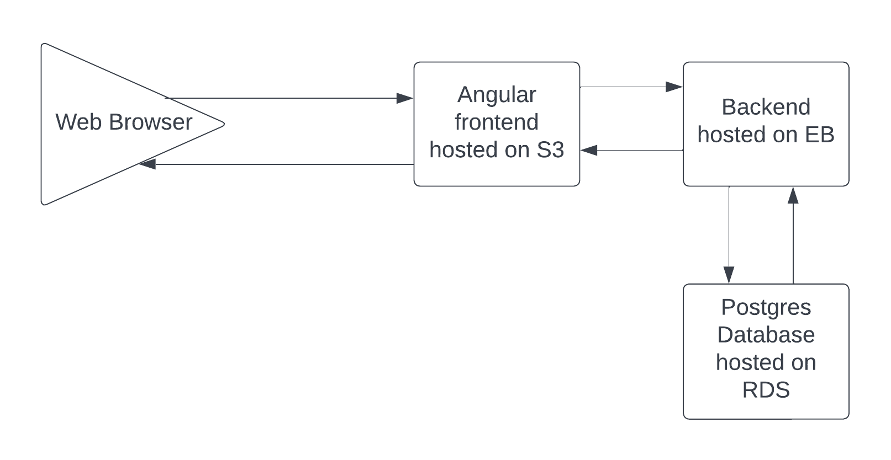

## AWS Service uses in project

- **RDS**
  - provides a public accessible PostgreSQL database
- **S3**
  - provides the frontend hosting
- **Elastic Beanstalk**
  - provides the backend hosting

### infrastructure diagram

### Elastic Beanstalk Environment

### S3 Bucket

### PostgreSQL RDS database

