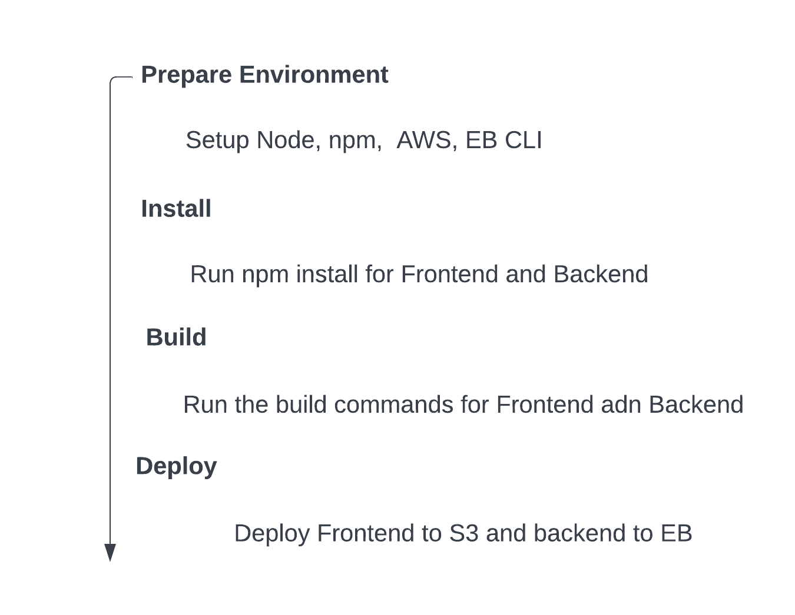
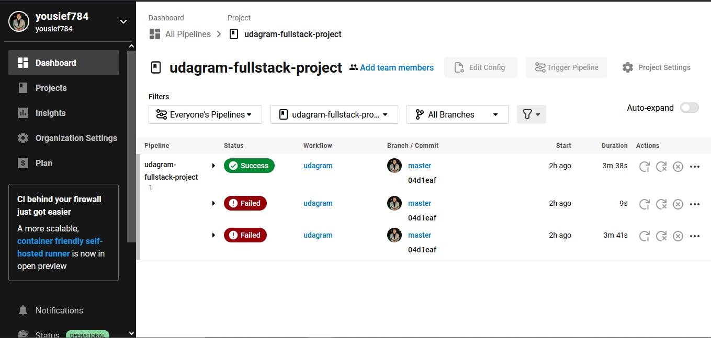
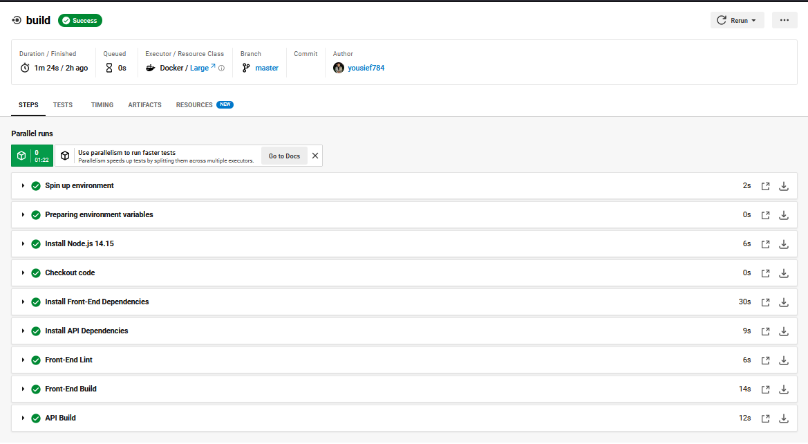
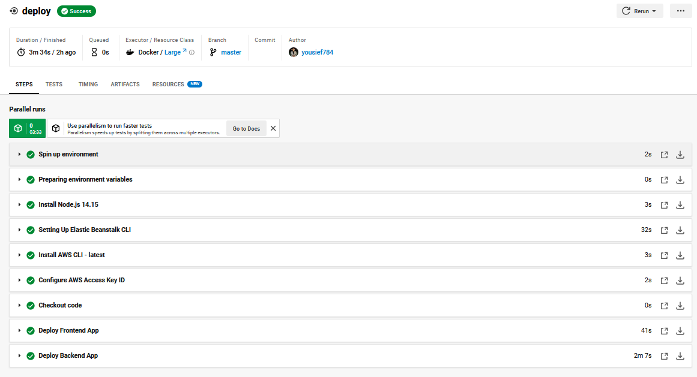
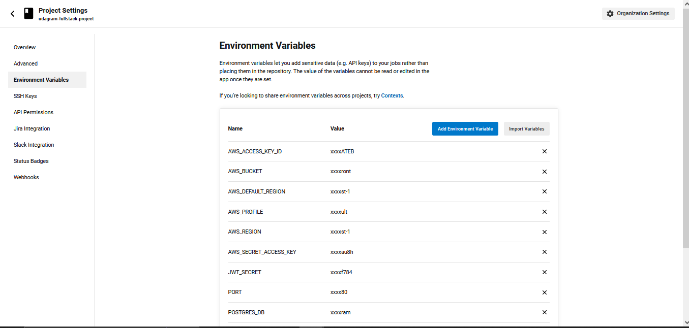

### Pipline process

The pipline is setup and connected with this github repo

1. Setup Node, AWS cli and the EB cli.
2. FrontEnd & BackEnd install
3. FrontEnd & BackEnd build
4. FrontEnd & BackEnd deploy

### CircleCI Steps

### CircleCI Pipeline

### CircleCI Build

### CircleCI Deploy

### CircleCI env

